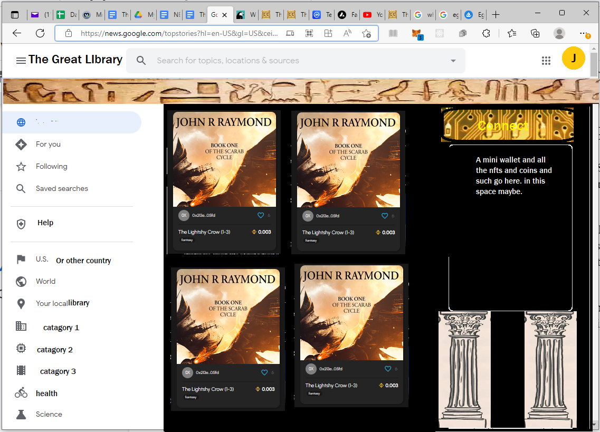

# The Great Library

All our code is open source:

1. Code for a django website
2. Code for creating smart html/html5.3
3. Code for creating and managing tokens on the backend
4. Unity code for the game
5. A new react frontend
5. All the best Guilds, Guides, and Goblins -- the numbers approved version of every game and franchies under the sun

## Major TODOs

1. Add 'use strict'; in all js code
2. Migrate away from moralis-backend.js to secure-mackend.js --jrr's current task (remove crypto package and use builtin one.)
3. Make site work from windows, macos, etc. 
4. Remove the heavy node_modules commits jrr made and move to using package.json
5. Add twitter-like capabilities for the messaging components of the site
6. Add domain name marketplace to the site
7. Create a react-native ereader for the books in the library
8. Add a new author portal for editing the text (and other memecodes)
9. Add jobs listings for the site (and others)
10. Create a react-native e-reader for the books in the library
11. Finish this list

# The Great Library’s Requirements

Welcome adventurer, you are not lost even if you aren't interested in Web3/Game-Fi...

In keeping with the Great Library’s mission to be open and transparent, here you will find documentation and information needed to understand the site and initial game-fi offering: The Scarab Cycle.

For starters, good games have 1) a good game play loop and 2) a good story. The stories for the games will come from the books, yet the loop comes from these requirements.

So let's get to it,

John R Raymond, Author of *The Scarab Cycle*

## Games for Gamers by Gamers
The major game companies no longer make games for gamers. This is the reason why we see such dissatisfaction from the professional gamer core. Companies stopped caring about what makes a good game from the player perspective and focused instead on other metrics like engagement. It is the same problem we see from social media. Anger can drive engagement in the short to near term, but in the end these platforms don't value the user needs and will collapse into the junk heaps that they are. 

They have all forgotten that they work for the people. They have forgotten that they must be curators of the public sphere. They forgot their mandate. They have become bad faith actors.

This is why there is toxicity. It is the companies' fault. They forgot that they are a public service. They don't think of themselves as an extension of the people. They think people as sheep to be sheared. They have become everything a good library isn't.

### Web3 doesn't have to be a bad things for games, gaming, or gamers
Web3 is a boon for our games. These open systems like the Avalanche Network provide technological capabilities to the libary which until now were the purview of large companies. These consensus networks provide several advantages:

#### 1. No realm servers
The first advantage is no more realm servers. The Avalanche network spreads the load across its servers seemlessly. You, the player, log into a web3 game and you don't choose where to connect to. You simply connect and are ready to play with all your freinds across the globe. No need for character transfers. There are no more cross realm guild problems. None of that nonsense is needed now. The "world computer" takes care of all that for us.

#### 2. Smart financing development of the games
Furthermore, web3 allows the library to pack a larger punch with less initial investment. It takes money to make a good game. Web3 allows the library to grow its titles organically while still delivering to the players something they want. We don't have to answer to investors. We only have to answer to the players.

### Casual isn't a dirty word
We play games to experience story, to enjoy content, and to have fun with our friends. "Softcore," "hardcore," and words like "casual" all have nebulous meaning we admit. But a casual player should be able to do things in a game regardless if the game is tailored to hardcore or softcore players. Why? Because if the game is designed right even casual players will enjoy playing it.

## The Professional Gaming Council
The first sizable cohort of professional gamers now walk the earth. They have wittnessed the industry grow, mature and finally come to this point of corruption and decay. This cohort currently supplies the voices for the gaming community. Men like Asmongold, Josh Strife Hayes, and Bellular Gaming's Michael and Matt speak for us all. They try to hold big companies' feet to the fire when it comes to game design. Yet to date, the big companies have ignored them. The reasons the companies do so is because they only care about the money, whereas a person like Matt cares about the game. Its a question of priorities. Copmanies prioritize money over everything.

The library prioritizes the people and art above revenues, because the library knows both are more important than simple dollars and cents.

### The library's commitment to the Council
The library is resolved to hear out and to act on the council's feedback if possible. Not all things requested by the council may find its way into, or out of the game. However, the library promises to work with the council to provide a philosophically sound game. Likewise, the library staff, its librarians and developers, promise to duely consider to any and all suggestions made by the council.

The library furthermore understands ultimately creating a good game means making something professionals want to play as well as the casuals.

### Joining the council
If you think you belong on the council, please email johnrraymond@yahoo.com or any of the other council members with your suggestions with evidentiary proof that you speak for the community in a cogent way. It also helps to be a professional gamer yourself. Furthermore, it may help to have a youtube channel or stream. Having a platform means you can hold our feet to the fire. It is a good way to prove you belong on the council.

## Time is valuable
Books in the great library have underlying smart contracts–more than one, but the ones we are most interested in for the game are the bookmarks as they are like owning property in Monopoly or even in real-life.

Let’s talk about the game…

The game depends on the bookmarks for profit sharing and as such each hero minted in the game is minted from a bookmark and the owner of the bookmarks take a small cut of the revenues when the items are sold on the in-game auction house.

This is not a free to play game but it is a cheap to play game that interacts with the library’s token: CultureCoin. This coin is not here to confuse players into microtransaction or into a gatcha loop. It is only here to further the Game-FI aspects.

Items players create using the mechanisms of the game have real-money implications and in no way do the creators wish to hide this fact through balkanized mechanisms.

The take-away is this: If you play this game and wish to make money at it we support that. Want to sell your hero? We support that. By playing the game you gain ownership of valuable in-game assets–as it should be. 

Remember, the player’s time is valuable.
## Planned Features
### Legendary item effects

### Item crafting

### In-game auction house

### User contributed cosmetics and art
    
## Commitment to the players
### We want a game in which money can play a part without it becoming evil:
    Players should be able to sell their characters, unlike in World of Warcraft.
    People without large disposable incomes should not be farmed by “whales.”
    Etcetera

### No loot boxes. 
Never ever. Any gambling on the site must be based on knowledge/skill.

### No predatory sales will ever be allowed. 
This is NOT diablo immortal.

## Threading the Needle of Pay-to-Win
For this version of the game the library’s token Culture Coin will play a role is the availability of loot and the purchase thereof. That means that aspects of the game will be pay-to-win. Therefore it is imperative we thread the needle and not fall into the traps other pay-to-win games fall into.

They say it cannot be done. However, it is possible with care. First off, the library’s token is the primary in-game currency. Heroes are minted with it, and items are bought and sold with it. It is the hope that the bookmarks heroes are minted from confer some advantage, or lack there of, given that bookmarks are a property that is ownable. Ownership should confer some privilege and in this “needle threading” they will.

First off the amount of reward gas locked in a bookmark should impact the quantity of loot available to the heroes minted from the bookmark. If a bookmark has no locked Culture Coin the bookmark for a scene only confers the scene level loot boost, say a 5% greater amount of loot from a mob killed within that scene for the heroes of that scene.

For example take scene one where Gaz is the main lootable mob. If your hero is minted from the bookmark for scene one, then when you loot Gaz with your hero you will receive 105 Gaz Identified ERC1155 tokens as loot, not the standard 100 of other heroes from all the other bookmarks.

However if Culture Coin has been locked into bookmark then the amount may be higher based on the following calculation: percent bonus is equal to the logarithm of CultureCoin divided by the normalization constant for the game. This constant is something like six or seven so that the locked Culture Coin bonus is effectively never greater than around 5%. So in the best case for a hero their bonus from killing Gaz may be as high as 10% more of the loot for killing and looting him.

So called “whales” should not have player power outrageously greater than people who do not have large sums of Culture Coin to throw away. Which brings us to the next section.
    
## The Library’s Philosophy on Games and Gaming
All games have issues which detract from the fun and while the library’s games will be no different, we strive to make any unfortunate aspects as innocuous as possible. We have a philosophy and it is that players should be able to enjoy all the content the game has to offer while by the time they reach 80% of the effective max power.
### The 80-20 rule
The 80-20 rule is a critical rule for understanding the library’s philosophy. The rule can be applied to many aspects of the game. Whales should only ever be able to get 20% more powerful than a minnow per unit time in the end game.
### No theft from the players
In Diablo II (d2) and Path of Exile (POE) if you die in the late game the game steals money and experience from you. This theft does not add anything to the game save to make it harder. It acts as a gatekeeper. But more importantly, it robs the player of fun. Also in D2 socketing a gem locks it in place and it cannot be removed without destroying it. Such destructive behavior from the game when it is not needed is also a form of theft.

If the game needs to burn tokens for economic reasons, then that process must be coded specifically to the problem and must give the player compensation in return. Having to nuke a gem or rune to replace it is not acceptable. Having to nuke them to upgrade something that can not be downgraded is much better.

### Caps are the enemy of flow
The best games allow the player to enter a state of mind known as flow and only breaks them out of flow when they fail to achieve an objective or when they succeed. This means that if the player sets out to do something, in the best world that thing they wish to do should be doable for as long as they wish it.

Therefore there should not be any caps to any activities. Such game design is coded to abuse the player into logging in everyday to do chores and the like. This is a big no no.
### Events are better than dailies
The use of events to entice people to play is much better than giving players daily chores in game.
### No abusive gambling
Life is a gamble. Everything we do is a gamble. But that doesn’t mean we should be addicted to gambling. Any gamble made in the game must be tied to skill, knowledge, or foresight. Loot boxes are right out.
### No parasitic design
All features should be synergistic. But what does that mean? It means that bolt-on systems are not allowed in the games. Movement is a synergistic design pattern in most RPGs. If you need to hit something out in the world with your staff, then you probably need to move to it.

If you are swinging your staff then having different swing timers is synergistic with the attack mode in question. However, once a game is made, adding on soulbinds like seen in World of Warcraft (WoW) do nothing but detract from the game. The same goes for outfitting pets and helpers like in Diablo III (d3.) Such systems detract from the game because they create unnecessary worry in the minds of the players. Instead of worrying about themselves and their friends they are worried about an NPC. This does nothing but make the game more complex without adding any real additional fun.

If the player has to have a helper, it is up to the game to outfit and supply the helper.
## Understanding Bookmarks Better
The text of a book is marked up to include section breaks. Each section is analogous to these bookmarks. On the site inside the html for the books a smart contract for the bookmarks supplies the ERC721 tokens that line up with these bookmarks/sections.
### Benefits of Ownership
They are critical to the game function as well as for petting BEN and other gambling mechanics on the site.
### Gambling on Bookmarks
The gamble will not be one that is based on pure luck. One must be able to predicate the future or have some skill to win.
### Petting BEN
Petting BEN is initially a way to interact with the AI custodian for the library. BEN is the friendly cat that likes to wander the digital stacks.
## Movement and Camera Controls in Game
Because the UI of any game is so critical, a theory of how it should work is important. Largely this game is inspired by the likes of Path of Exile (PoE) and World of Warcraft (WoW.) Because of the speed of the game and the need to target the spells and abilities, the WoWmodel of movement and camera control is what we are shooting for.

Clicking both mouse buttons will cause the player to move forward and then WASD can help modify those movements.

Targeting will require selecting the mobs individually at the start and possibly a location at some point for area of effect spells and abilities.
    
## The Library's Marketing Pitch
    
We are pleased to introduce the next evolution of the written word. By blending artistic content, NFT’s, gaming and AI, we have leapt past the current saturated e-reader market and bring something new which marries the best of physical mediums with the ease of digital ones.

Take the humble book. It is physical, tactile, collectible. A library is a sign of culture to some, and speaks of your passion and interests. Books can take us to far away places, or teach us things we never thought were possible. They are, sadly, cumbersome, entirely static, and once read are stored, collecting dust.  But most damaging, there is a significant barrier to entry that barres all but the most easily marketed. New Authors have a steep hill to climb to enter into this tight market as the cost to print, store and distribute and market physical media is high, and publishers, facing an increasingly cluttered market fear to innovate.

E-Books tried to address this shortcoming, but have shortcomings of their own. Gone is the collect-ability, and the book is still static and unchanging. Barriers to entry are lessened to an extent that now virtually anyone can publish their tome, but in a saturated  market it is even more difficult and expensive to expose a new book to potential buyers. Some authors are experimenting with the Patreon system in an effort to serialize their writing and give their reoccurring fans early access in an effort to generate income, but this has met very limited success.

Smartbooks are radically different.  They are collectable and dynamic, capitalizing on the advantage of the digital medium, driving the story into hitherto unreached markets.  NFT tokens generated from the work proves exclusive ownership of a piece of literature, with the secure backbone of the crypto block-chain networks. Buy and sell on the integrated marketplace with other avid collectors and fans. Authors are automatically granted a portion of current and future resales through blockchain technology.  Reader apps give access from all HTML-5 devices, and instant feedback and AI tools guide the author in optimizing their success.  The sale of bookmarks, embedded games, and even advertisements will generate additional revenue and excitement.  There is almost no limit to the possible content, including limited artwork, AI pets, exclusive author access, audiobooks and even the distribution of limited edition physical media, yes, the old fashioned printed book. 

Ongoing revenue will be secured through the portion of sales perpetually generated in the NFT marketplace. Marketing and site placement are premiums for potential creators to place their offerings. Smart Media will become the standard for the future because it allows successful authors to interact with their public on a level that is not possible no other way.

## The React Frontend

The current site allows users to connect to the books directly inside a frame. This will be unnecessary with the new skin on the frontend. There will be no frames and the users will be able to connect to the full site directly. The book text will be sent to the frontend from the backend api and then will be injected into the page.
    

    A mock up of the proposed site
    
# The Full Requirements: OxFxM
Pronounced “Oh, cross Eff, cross Em,” the OxFxM model of requirements traceability is what this project uses for its main high level design and will include all of the great library. Operations are the highest level actions that users and AIs can take. Whereas the functionalities implement large swaths of these operations. The module level is the lowest level and is at the function or subroutine level of the code.

As a good developer, ask yourself why am I writing this code if there is no functionality it supports?
## Operations
Welcome the high level operations that users can accomplish when using the software you are writing. These are the “Steve Jobs Level” concepts. These are what he worried about when he made his code. Is the user experience clean and consistent across all the operations the users partake in? At the highest level we do not worry about what functionalities are needed to implement, we simply assign them the functionalities needed to accomplish the goal and as we work through the operations we worry about the UX (user experience.)

### Connect to Network

### Mint One Bookmark

### Mint 1-10 Bookmarks with Rewards

### Purchase Bookmark

### Sell Bookmark

### Transfer Book

### Purchase Book

### Transfer Book

### Sell Bookmark

### Purchase Hardbound

### Read Book

### Save Book

### Pet BEN

### Mint Hero

### Sell Hero

### Launch Game

### Zone-In

## Functionalities


## Modules
async function getBENResponse(myPrompt)
Based on myPrompt BEN is to generate a text response using a GPT to provide an in-character response that follows from the prompt.

## A Case Study: Scene One

The users currently have to sign all their actions on chain but we will allow a bridge to remove that in the future. So say player1 zones into scene one:

    GAZ and RENNLY are fighting

    GAZ is an enemy NPC

    GAZ has 50 hp
    
    Player1 cast Druidfire by running the contract function: BaseLoot.sol::castDF()

    The transaction kills GAZ

    Player1 loots GAZ by calling: BaseLoot.sol::loot()


What this means in Unity is the user selects GAZ and pressed the 1 key which is mapped to “Druidfire” let’s say. So the unity CS code calls userPressed1Key(). Then inside that function it determines there is a mapping to Druidfire for key 1 and that the user wants to cast Druidfire.

So now inside userPressed1Key() a new function is called: doDruidFireForUser()

This function will call a contract function castDF() which requires the user to sign the tx using metamask or some wallet.

In the future, however, doDruidFireForUser() can call into bridging code on the cloud that will call castFD() on behalf of the user so they do not have to sign the transaction themselves. 

This new bridging ability will likely happen when we move to our own Avalanche Subnet.

## Loot and the “Cube”
TimeCube.sol was inspired by the great ether-monster in the sky. But what is it for? It is for controlling many aspects of the game, but primarily, users will use “the cube” to transmute the loot they get off of monsters and mobs in the game to create items: ERC721 items to be specific.

### A quick rundown of how loot works
When a lootable NPC dies, players calling the BaseLoot.sol:loot() contract function cause a mint of a new ERC1155 with the hero token id of the dead mob as its identifier. This ERC1155 is transferred to the msg.sender, AKA the player’s wallet.

Then the user has to call TimeCube.sol::transmute() to convert the ERC1155 to the ERC721 which is the item. Many pieces of loot may be required to create the best items in the game. So 1, 2, 3 or even 20+ ERC1155 loot tokens may be necessary to craft the best legendary items.
## Beyond Game-Fi
Maybe you aren’t a game developer but still want to contribute? We need to make the e-reader for the Great Library’s smart-books and a total reskin of the site. Skills include JS, REACT, PYTHON, WEB3 and many more. We are looking for people who are just starting their WEB3 journey as well as old hands at software development.

If you are interested in contributing in- or outside of the game email: johnrraymond@yahoo.com or see me on discord https://discord.gg/mdSKcX5PeE

You will still be paid even if you aren’t working on the game itself.

## The React Version of the Great Library
The current version of the website uses moralis’ vanilla js. This react initiative is two-fold. Part one is to replace the site with a react frontend that is maintainable in the ways js is not. The second push is to make a react-native e-reader for the books.

## The Secure Backend
The CCA private key should not be on disk in the .env file without being encrypted. Likewise the keys used for the ssl node server code should also be encrypted. The plan is to run the backend in GNU’s Screen. It requires the admin/librarian in charge of the server to type in the password to decrypt everything into memory, including the cCAPrivateKey.

By setting the cCAPrivateKey="encrypted" and the password to "production" the site will attempt to comunicate using ssl to the secure-backend using
https://secureHost:securePort/

To facilitate the transition, if the password is not "production," the value in the .env will not be decrypted but used directly.

Generate your ssl keys using the same password used to encrypt your private key
```
moralis$ sh gensslcert.sh
```
    
Run the backend like:
```
moralis$ node secure-backend.js 9999 127.0.0.1 127.0.0.2 127.0.0.1
```
This says that calls from 127.0.0.1 and .2 are allowed. Add your webhost IP address to the list to accept connnections from it as well.
 
# Getting Started
:warning: **Please pull the master code before making pull requests or committing**: Be very careful here! (Looking at your JRR.)
    
    git pull
    git commit
    git push

## Windows Development

For windows development in Unity use Visual Studio Code. ***COMMUNITY VERSIONS DO NOT WORK!***

Install the solidity extension to compile the contracts.

# Installing the Server

## Setting up your Linux development environment

This installation walkthrough assumes a ubuntu 20.04. (Works with digital ocean's 20.04LTS droplets.)

Remember the first thing to do is to set up the DNS or you will not be able to created your SSL keys as needed by apache certbot if you want to test your code using apache.

As root admin the droplet by adding john and yourself.  ***john is the effective nobody for the website.***

```
adduser john                                                # Give john a strong password. (never login with him.)
usermod -aG sudo john && gpasswd -a john sudo
adduser yourusernamehere                                    # Use strong password.
gpasswd -a yourusernamehere sudo
usermod -aG john yourusernamehere
chmod g+w /home/john

```

***Log in again if sudo doesn't work.***

## Set up the site user and directories


Add/verify /mnt/* exists and has plenty of space
``` 
df -h
```

# Create a great library server for development

Prep apache and mod_wgsi: 
```
sudo apt update
sudo apt install apache2 apache2-utils ssl-cert libapache2-mod-wsgi-py3 nodejs npm
sudo npm install  ganache-cli --global
sudo a2enmod wsgi
```

Make the bakerydemo from the greatlibraryserver:
```

sudo apt install python3-virtualenv pip
cd ~john
virtualenv wagtailbakerydemo --python=python3

. ../wagtailbakerydemo/bin/activate

sudo apt-get install libtiff5-dev libjpeg8-dev libopenjp2-7-dev zlib1g-dev \
    libfreetype6-dev liblcms2-dev libwebp-dev tcl8.6-dev tk8.6-dev python3-tk \
    libharfbuzz-dev libfribidi-dev libxcb1-dev   # for pillow
 
pip3 install pymysql
pip3 install django_dramatiq
pip3 install redis
pip3 install django_extensions
pip3 install django-ckeditor
pip3 install django-cors-headers
pip3 install simplejson
pip3 install filelock
pip3 install django-richtextfield

pip3 install dj_database_url
pip3 install django_cache_url
pip3 install whitenoise

npm install crypto                                          ## for the secure moralis backend.
npm install @opentelemetry/sdk-node @opentelemetry/api      ## ditto
```

~~python3 -m pip uninstall python-dotenv~~ # for AttributeError: module 'dotenv' has no attribute 'read_dotenv'

```
sudo apt install git
git clone https://github.com/johnrraymond/greatlibraryserver
cp -r greatlibraryserver bakerydemo
cd bakerydemo
pip3 install -r requirements/base.txt

sudo apt install python3.8-venv
sudo apt-get install pipx
pipx install eth-brownie
pipx ensurepath
source ~/.bashrc

sudo npm install -g moralis-admin-cli
chmod go+w /usr/local/lib/node_modules/moralis-admin-cli/  # Dont do this it is wrong but might fix some error you dont want...

sudo apt install imagemagick   # For autogen of bookmark images...
```

# Copy the env.example.
```
cp env.example .env
```

## Make a new development culture coin administrator account for yourself
```
brownie accounts generate Account1

SUCCESS: A new account '0x183a3e96a8D52E4f4b07688aCfa0fCF50a4CFF02' has been generated with the id 'Account1'
```

***Save the account address and password. The account needs to be added to ~john/bakerydemo/.env as the cCA***

# Find your private key cCAPrivateKey and cCAPrivateKeyEncrypted
```
(cd ~john/bakerydemo/moralis; node getPrivateKey.js "your mnemonic here" vOVH6sdmpNWjRRIqCc7rdxs01lwHzfr3)     ## Change the password to your real password for prod
```

# Edit the .env file like:
> vi ~john/bakerydemo/.env


## MOCK DEPLOY
```
cd ~john/bakerydemo/brownie
brownie run scripts/deployDummy.py  --network=avax-test
### ValueError: insufficient funds for gas * price + value: 

Fund your new account. Use metamask or some online pay tool.
brownie run scripts/deployDummy.py  --network avax-test
#### DummyContract deployed at: 0xSomewhere
```

## DEPLOY CULTURE COIN, etc
```
brownie run scripts/deployCultureCoinProxyAdmin.py  --network=avax-test     ## add address as proxyAdmin
brownie run scripts/deployCultureCoin.py  --network=avax-test               ## add the contract addrss to the .env as cultureCoinAddressImpl
brownie run scripts/deployCultureCoinProxy.py  --network=avax-test          ## cultureCoinAddress

brownie run scripts/deployMarketPlace.py  --network=avax-test
brownie run scripts/deployPrintingPress.py --network=avax-test

# Deploy the game parts that you can
brownie run scripts/deployBaseSpells.py  --network=avax-test                ## baseSpellsImplAddress
brownie run scripts/deployBaseSpellsProxy.py  --network=avax-test           ## baseSpellsAddress
brownie run scripts/deployBaseLoot.py  --network=avax-test                  ## baseLootImplAddress
brownie run scripts/deployBaseLootProxy.py  --network=avax-test             ## baseLootAddress

## Need the rest of the site deployed for the rest of the game... need a bookmark for the heros, etc
```

## Copy in the database file
```
cd ~john/bakerydemo
sudo cp  ~/bakerydemodb bakerydemodb
```
Expand the library.books.tar.gz into /mnt/media_dir as john:
```
cd /mnt
sudo tar -zxvf ~/library.tar.gz

# This is how you create this tar file:
#/mnt/% tar cvfz library.tar.gz  media_dir/{BOOKV1/,CHAME/,DCBT/,GBCC/,GLBP/,HFMIO/,MBMPGBRRR/,TDAWP/,TDBR/,TLSC/} media_dir/default-bookmark.png
# or if fresh and untainted:

tar cvfz library.tar.gz  media_dir/ media_dir/default-bookmark.png
```

# Setting up the media dir
```
rm /home/john/bakerydemo/bakerydemo/templates/art/datamines
ln -s /mnt/media_dir  /home/john/bakerydemo/bakerydemo/templates/art/datamines
#sudo mkdir /mnt/media_dir

sudo chown john:john /mnt/media_dir

cd ~john/bakerydemo/
python3 ./manage.py collectstatic
python ./manage.py migrate

```

## Deploy a bookmark  using the dev site...
```
cd ~john/bakerydemo

. .env && python3 manage.py runserver 0.0.0.0:9466

```


## Deploy the rest of the game contracts using a bookmark contract for bookmmarkAddress in the .env (e.g. bookmarkAddress="0x9d3f59e810ec2250adcc3aa5947e48d6d927850b"), the DaedalusClassBoosterToken's address and benScratchesAddress
```
brownie run scripts/deployMyItems.py --network=avax-test                ## myItemsAddress
brownie run scripts/deployHero.py --network=avax-test                   ## heroAddress
brownie run scripts/deployTimeCube.py --network=avax-test               ## timeCubeImplAddress
brownie run scripts/deployTimeCubeProxy.py --network=avax-test          ## timeCubeAddress

brownie run scripts/deployTheGoldenKeys.py --network=avax-test          ## theGoldenKeysAddress
brownie run scripts/deployBEN.py --network=avax-test                    ## benDeployAddress
```

## Next the ssl keys
```
sudo apt install certbot python3-certbot-apache
```

Edit the apache config /etc/apache2/sites-available/000-default-le-ssl.conf to look like:
```
<IfModule mod_ssl.c>
<VirtualHost *:443>

        ServerAdmin johnrraymond@yahoo.com
        DocumentRoot /home/john/bakerydemo/

        ErrorLog ${APACHE_LOG_DIR}/error.log
        CustomLog ${APACHE_LOG_DIR}/access.log combine

    Alias /static /home/john/bakerydemo/bakerydemo/collect_static
    <Directory /home/john/bakerydemo/bakerydemo/collect_static/>
        Require all granted
    </Directory>

    <Directory /home/john/bakerydemo/bakerydemo>
        <Files wsgi.py>
            Require all granted
        </Files>
    </Directory>

    WSGIDaemonProcess bakerydemo python-home=/home/john/wagtailbakerydemo python-path=/home/john/bakerydemo/
    WSGIProcessGroup bakerydemo
    WSGIScriptAlias / /home/john/bakerydemo/bakerydemo/wsgi.py

<Directory /home/john/bakerydemo/>
  Require all granted
</Directory>


<Directory /home/john/bakerydemo/>
  Require all granted
</Directory>

</VirtualHost>
</IfModule>
```

Now fight with dns as you try to run:
```
sudo certbot --apache
```

## Edit /etc/apache2/envvars to have these lines instead of what it has:
```
export APACHE_RUN_USER=john
export APACHE_RUN_GROUP=john
```

 
```
sudo systemctl restart apache2
```

add admin to wagtail if needed

```
cd ~john/bakerydemo
python3 manage.py migrate

DJANGO_SETTINGS_MODULE=bakerydemo.settings.production python ./manage.py createsuperuser

. .env && python3 manage.py runserver 0.0.0.0:9466#change this # for security reasons
```

# Set up the OfferingsPlaced event listener on moralis.io/servers

From “View Details” for the mainnet server click on “Sync.”

Either add or edit the offerings placed “Sync and Watch Contract Events”
```
Topic:
OfferingPlaced(bytes32, address, address, uint, uint, string)
```

ABI
```
{
  <from files...>
}
'''

Address:
```
<THE CONTRACT DEPLOY ADDRESS>
```
    
Table:
```
PlacedOfferings             # placedOfferings in .env
```

Click confirm.

Save the contracts address, you will need it later in this walk through.

Save the table name in the .env

## BookContracts

Do the same thing again for the BookContracts table and event listener. But this time watch the Printing Press address.
Setting the code for mainnet

```
npm  install --save web3

sudo npm install -g moralis-admin-cli
sudo chown -R <yourusername>:john /usr/local/lib/node_modules/moralis-admin-cli/
 
moralisApiKey="2cEzQ3XynlRGWLR"
moralisApiSecret="SXA9P9laLO8HKr8"
moralisSubdomain="qzzj9cxkd0zd.usemoralis.com"
```

This is the final step: Deploy Cloud :: If you are uncertain about running this command then you probably want to still step up the rest of the site

```
sh bakerydemo/autosavecloud.sh &
% bash deployCloud.sh
```

Browse to the dev site address ... horay! Dev should work.

Then run:
```
sudo systemctl restart apache2
```

The site should be working…
    
https://droplet.greatlibrary.io/admin/login/?next=/admin/  Login with you username and password.

# To run dev site run a command like the following but change the port number:
```
/home/john/bakerydemo$  .   .env && python3 manage.py runserver 0.0.0.0:9466
```

### WARNING DO NOT DO THIS STEP UNLESS YOU NEED TO
```
git clone https://github.com/eth-brownie/brownie.git
cd brownie
sudo python3 setup.py install
```

~~pip3 install django-dotenv~~
